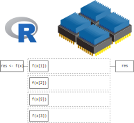
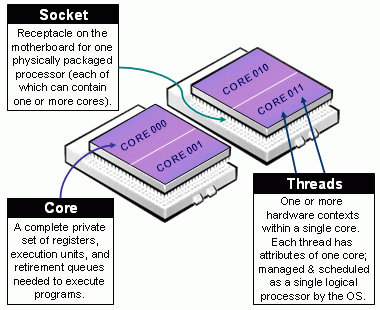
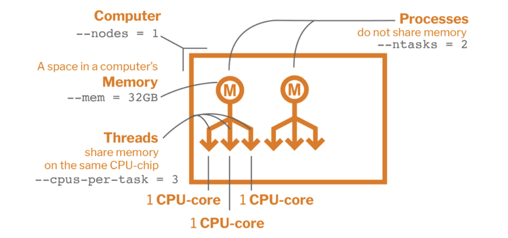
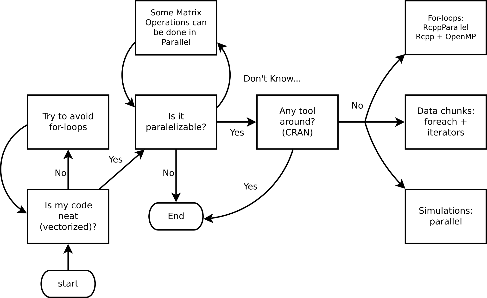

```{python}
#| include: false
import multiprocessing
import numpy as np
import time
import concurrent.futures
import timeit
```

## What is HPC

High Performance Computing (HPC) can relate to any of the following:

- **Parallel computing** — using multiple resources (threads, cores, nodes, etc.) simultaneously to complete a task faster.
- **Big data** — working with large datasets (in/out-of-memory), e.g. via lazy loading and chunked processing.
- **Accelerated computing** — offloading work to specialized hardware such as Field Programmable Gate Arrays (FPGAs) and Graphics Processing Units (GPUs).

::: {.callout-note}
Today we will focus on **parallel computing**.
:::

---

## Serial computation

{fig-align="center" width="30%"}

---

## Serial computation

- Serial programming is the default method of code execution.
- Code is run sequentially, meaning only one instruction is processed at a time (line-by-line).
- Code is executed on a single processor, so only one instruction can execute at a time.

---

## Parallel computation

{fig-align="center" width="90%"}

---

## Parallel computation

Parallel computing is the simultaneous use of multiple compute resources to solve a computational problem:

- A problem is broken into discrete parts that can be solved concurrently
- Each part is further broken down to a series of instructions
- Instructions from each part execute simultaneously on different processors
- An overall control/coordination mechanism is employed

---

## Parallel computation

The parallel compute resources are typically:

- **Shared memory (single node)** — a single computer with multiple processors/cores that all share the same RAM. Fast communication between cores, but limited by the number of cores and memory on one machine.

- **Distributed memory (multi-node)** — an arbitrary number of computers connected by a network. Each node has its own memory; data must be explicitly passed between nodes (e.g. via MPI). Scales to thousands of nodes.

- **Hybrid** — most modern HPC clusters combine both: multiple nodes (distributed), each with many cores (shared). Programs often use MPI across nodes and threading/multiprocessing within a node.

- **Accelerators (GPUs/FPGAs)** — specialized hardware attached to a node that can execute thousands of simple operations simultaneously. Ideal for data-parallel tasks like matrix operations and deep learning.

---

## Parallel computing: Hardware

When it comes to parallel computing, there are several ways (levels) in which we can speed up our analysis. From the bottom up:

- **[SIMD instructions](https://en.wikipedia.org/wiki/Single_instruction,_multiple_data)**: Most modern processors support vectorization — applying a single instruction to multiple data elements simultaneously, e.g. adding vectors `A` and `B` element-wise in one operation.
- **[Hyper-Threading Technology](https://en.wikipedia.org/wiki/Hyper-threading)** (HTT): Intel's Hyper-Threading exposes two logical cores per physical core by duplicating parts of the processor state. It does not double performance, but improves throughput when one logical core is stalled (e.g. waiting on memory).
- **[Multi-core processor](https://en.wikipedia.org/wiki/Multi-core_processor)**: Most modern CPUs have multiple independent physical cores. A typical laptop in 2026 has 10–16 cores; server CPUs can have 64 or more.

---

## Parallel computing: Hardware

- **[GPGPU](https://en.wikipedia.org/wiki/General-purpose_computing_on_graphics_processing_units)** (General-Purpose GPU computing): While modern CPUs have tens of cores, GPUs contain tens of thousands of smaller cores optimized for data-parallel work. Originally designed for graphics, GPUs are now central to scientific computing and machine learning (e.g. NVIDIA H100 has ~16,896 CUDA cores). The [Digital Research Alliance](https://alliancecan.ca/en/services/advanced-research-computing/federation/national-host-sites) (formerly Compute Canada) provides GPU access to researchers.
- **[HPC Cluster](https://en.wikipedia.org/wiki/Computer_cluster)**: A collection of computing nodes interconnected by a high-speed, low-latency network such as **InfiniBand** (not standard Ethernet). Nodes typically combine multi-core CPUs and GPUs.
- **[Grid Computing](https://en.wikipedia.org/wiki/Grid_computing)**: A collection of loosely interconnected machines that may or may not be in the same physical location, for example HTCondor clusters. Lower bandwidth and higher latency than a dedicated HPC cluster.

---

## Parallel computing: Terminology

**CPU** (Central Processing Unit): The main processor of a computer, consisting of one or more cores. A server may house multiple CPUs on separate *sockets*, each with its own local memory.

**Socket**: A physical slot on the motherboard that holds one CPU chip. Nodes with multiple sockets have NUMA (Non-Uniform Memory Access) architecture — memory attached to a different socket is slower to access.

**Core**: An independent processing unit within a CPU. Each core can execute its own thread or process simultaneously with other cores.

**Node**: A standalone computer — typically several CPUs, RAM, storage, and network interfaces. Nodes are networked together to form a cluster or supercomputer.

**Cluster**: A collection of nodes managed as a single system, sharing a job scheduler and file system.

---

## Parallel computing: Terminology

**Thread**: The smallest unit of execution scheduled by the OS. Threads within the same process share memory, making communication fast but requiring synchronization to avoid race conditions.

**Process**: An independent program instance with its own memory space. Processes do not share memory by default — communication requires explicit mechanisms (pipes, sockets, shared memory).

::: {.callout-important}
**Python's GIL**: The standard Python interpreter — **CPython** (written in C, downloaded from python.org) — has a Global Interpreter Lock (GIL): a mutex that allows only one thread to execute Python bytecode at a time, even on a multi-core machine. This means Python *threads* cannot run truly in parallel. To achieve real parallelism in Python, use **multiple processes** (`multiprocessing`) so each process has its own interpreter and GIL.

*Note: Python 3.13 introduced an experimental "free-threaded" (no-GIL) build, but it is not yet the default.*
:::

---

## Parallel computing: CPU components

{fig-align="center" width="45%"}

---

## Parallel computing: Terminology

**Job**: A unit of work submitted to a cluster scheduler (e.g. SLURM). A job specifies the resources needed (cores, memory, time) and the commands to run. It may contain one or more tasks.

**Task**: A single executable unit within a job, typically mapped to one process running on one or more cores.

**Worker**: In Python's `multiprocessing` and `concurrent.futures`, a worker is a spawned process that picks up and executes tasks from a shared queue. A `Pool(4)` creates 4 worker processes.

**SLURM** (Simple Linux Utility for Resource Management): The dominant open-source job scheduler on HPC clusters. Users submit jobs with `sbatch`; SLURM allocates nodes, queues work, and manages priorities.

---

## Parallel computing: Components

{fig-align="center" width="70%"}

---

## Parallel Programming Models

There are several parallel programming models in common use:

- Shared Memory (without threads)
- Threads
- Distributed Memory / Message Passing (e.g. MPI)
- Data Parallel
- Hybrid
- Single Program Multiple Data (SPMD)
- Multiple Program Multiple Data (MPMD)

---

## Do I need HPC?

{fig-align="center" width="60%"}

---

## Top 10 HPC: www.top500.org

{fig-align="center" width="100%"}

[See the latest list](https://www.top500.org/lists/top500/2025/11/). [And some cool stats](https://www.top500.org/statistics/list/)

---

## Parallel computing in Python

While there are several ways to do parallel computing in Python, we'll focus on the following for **explicit parallelism**:

> - [**multiprocessing**](https://docs.python.org/3/library/multiprocessing.html): Python standard library module that supports spawning processes using an API similar to the threading module.
> - [**concurrent.futures**](https://docs.python.org/3/library/concurrent.futures.html): A high-level interface for asynchronously executing callables using threads or processes.

---

## Parallel computing in Python

> - [**joblib**](https://joblib.readthedocs.io/): A set of tools to provide lightweight pipelining in Python, particularly useful for embarrassingly parallel for loops.
> - [**multiprocess**](https://github.com/uqfoundation/multiprocess): A fork of `multiprocessing` that uses `dill` instead of `pickle` for better serialization.

Implicit parallelism tools include **numpy** (BLAS-backed), **numexpr**, and **tensorflow**/**pytorch** for GPU acceleration.

---

## Parallel computing in Python

More advanced options:

> - [**mpi4py**](https://mpi4py.readthedocs.io/): Python bindings for MPI (Message Passing Interface) for large-scale distributed computing.
> - [**Dask**](https://dask.org/): Parallel computing library that scales from a laptop to a cluster, with familiar NumPy/Pandas APIs.
> - [**Ray**](https://ray.io/): Framework for distributed computing, especially popular for ML workloads.

---

## Embarrassingly Parallel

Many problems can be executed in an "embarrassingly parallel" way, whereby multiple independent pieces of a problem are executed simultaneously because the different pieces of the problem never really have to communicate with each other (except perhaps at the end when all the results are assembled).

---

## Embarrassingly Parallel

The basic mode of an embarrassingly parallel operation can be seen with a Python `for` loop or list comprehension. Recall that we often want to apply the same function to each element of a list independently.

The `map()` function applies a function to each element of an iterable — this maps naturally onto parallel execution with `Pool.map()`.

NOTE: NumPy operations are already vectorized (implicit parallelism via BLAS), but for arbitrary Python functions we need explicit parallelism.

---

## Parallelization

Conceptually, the steps in the parallel procedure are:

1. Split list `X` across multiple cores
2. Copy the supplied function (and associated environment) to each of the cores
3. Apply the supplied function to each subset of the list `X` on each of the cores in parallel
4. Assemble the results of all the function evaluations into a single list and return

---

## The multiprocessing module

- Part of the Python standard library — no install required.
- Explicit parallelism via separate Python **processes** (avoids the GIL).
- Simple API: `Pool` provides `map`, `starmap`, `apply_async`, etc.
- Clusters can use `Pool` locally or tools like `mpi4py` remotely.
- On Unix: supports **forking** (`fork`/`forkserver`). On Windows: **spawn** only.
- Let's look at our session info

```{python}
import sys, platform, numpy, multiprocessing, concurrent.futures
print(f"Python:          {sys.version}")
print(f"Platform:        {platform.platform()}")
print(f"NumPy:           {numpy.__version__}")
print(f"CPUs available:  {multiprocessing.cpu_count()}")
```

---

## Example 1: Hello world!

This example demonstrates the basic structure of a parallel job in Python:

1. **Define a function** (`hello_from_process`) that each worker process will run — it reports its own process ID so we can confirm the work is spread across different processes.
2. **Create a pool** of 4 worker processes using `multiprocessing.get_context("fork").Pool`.
3. **Distribute the work** with `pool.map()`, which sends one copy of `x` to each of the 4 workers and collects their return values.
4. **Print the results** — each line should show a different process ID, confirming parallel execution.

```{python}
import multiprocessing
import os

def hello_from_process(x):
    return f"Hello from process #{os.getpid()}. I see x and it equals {x}."

x = 20
ctx = multiprocessing.get_context("fork")
with ctx.Pool(processes=4) as pool:
    results = pool.map(hello_from_process, [x] * 4)
for r in results:
    print(r)
```

---

## Example 2: Parallel regressions

**Problem**: Run 999 independent univariate regressions on a wide dataset:

$$
y = X_i\beta_i + \varepsilon,\quad \varepsilon\sim N(0, \sigma^2_i), \quad i = 1,\ldots,999
$$

```{python}
import numpy as np

rng = np.random.default_rng(131)
y = rng.standard_normal(500)
X = rng.standard_normal((500, 999))
print(f"X shape: {X.shape}")
print(f"y shape: {y.shape}")
```

::: {.callout-tip}
Each regression is completely independent — a classic embarrassingly parallel problem.
:::

---

## Example 2: Parallel regressions (cont'd)

**Key design rule**: worker functions must be **self-contained** — pass all needed data as arguments, never rely on globals. We pack `(col, y)` into a tuple so `pool.map` can distribute it.

```{python}
def fit_ols(args):
    """Fit OLS: y ~ x. Takes a (col, y) tuple; returns (intercept, slope)."""
    col, y_vec = args
    A = np.column_stack([np.ones(len(col)), col])
    coeffs, _, _, _ = np.linalg.lstsq(A, y_vec, rcond=None)
    return coeffs

# Build argument list: one (col, y) tuple per regression
job_args = [(X[:, j], y) for j in range(X.shape[1])]

# Serial baseline
ans_serial = [fit_ols(a) for a in job_args]
print("Serial coefficients (first 5 columns):")
print(np.array(ans_serial).T[:, :5])
```

---

## Example 2: Parallel regressions (cont'd 2)

```{python}
import time

# Parallel — use fork context (required in Jupyter/Quarto on macOS)
ctx = multiprocessing.get_context("fork")

t0 = time.perf_counter()
ans_serial_timed = [fit_ols(a) for a in job_args]
t_serial = time.perf_counter() - t0

t0 = time.perf_counter()
with ctx.Pool(processes=4) as pool:
    ans_parallel = pool.map(fit_ols, job_args)
t_parallel = time.perf_counter() - t0

print(f"Serial:   {t_serial*1000:.1f} ms")
print(f"Parallel: {t_parallel*1000:.1f} ms")
print(f"Speedup:  {t_serial/t_parallel:.2f}x")

# Verify results match
assert np.allclose(np.array(ans_serial_timed), np.array(ans_parallel))
print("Results match ✓")
```

---

## Example 2: Why is the parallel version *slower*?

Three reasons:

- **Data overhead**: `job_args` contains 999 copies of `y` (each 500 × 8 bytes ≈ 4 KB), so ~4 MB is pickled and sent to workers — more work than the compute itself.
- **Tasks are too fast**: each OLS fit takes ~0.04 ms. IPC and scheduling overhead per task easily exceeds that.
- **BLAS is already parallel**: `numpy.linalg.lstsq` calls multi-threaded BLAS internally — the "serial" loop is already exploiting multiple cores implicitly.

::: {.callout-important}
**Rule of thumb**: Python multiprocessing pays off when tasks are **slow pure-Python or I/O-bound work** (≥ tens of ms each) and data transferred per task is small. For fast NumPy operations, vectorization or implicit BLAS parallelism is already better.
:::

The influenza simulation next avoids all three pitfalls — tasks are slow Python loops with no BLAS shortcut, and each task only receives a small integer seed.

---

## Extended Example: Influenza simulation

An altered version of [Conway's game of life](https://en.wikipedia.org/wiki/Conway's_Game_of_Life)

1. People live on a torus grid, each individual having 8 neighbors.
2. A susceptible individual interacting with an infected neighbor contracts influenza with probability depending on vaccination status:
   a. **60%** if neither is vaccinated.
   b. **25%** if only the susceptible individual is vaccinated.
   c. **40%** if only the infected neighbor is vaccinated (reduces onward transmission).
   d. **8%** if both are vaccinated.

---

## Extended Example: Influenza simulation

3. Infected individuals recover or die after one time step: **5% mortality**, 95% recover.

We want to illustrate the importance of vaccination coverage. We simulate a grid of 900 (30 × 30) individuals 50 times to analyze: (a) the contagion curve, (b) the death toll under 0%, 50%, and 100% vaccination coverage.

More models like this: The [SIRD model](https://en.wikipedia.org/wiki/Compartmental_models_in_epidemiology#The_SIRD_model) (Susceptible-Infected-Recovered-Deceased)

---

## Conway's Game of Flu: Python Setup

```{python}
import numpy as np

# Status codes
SUSCEPTIBLE = 0
INFECTED    = 1
RECOVERED   = 2
DECEASED    = 3

# Transmission probabilities: [neither vacc, only self vacc, only neighbor vacc, both vacc]
probs_transmit = [0.60, 0.25, 0.40, 0.08]
prob_death = 0.05  # seasonal influenza mortality in simulation
```

---

## Conway's Game of Flu: Simulation

```{python}
def simulate_flu(pop_size=900, n_sick=10, n_vaccinated=0,
                 n_steps=15, seed=None):
    rng = np.random.default_rng(seed)
    n = int(np.sqrt(pop_size))
    status = np.zeros((n, n), dtype=int)  # all susceptible

    # Infect initial individuals
    sick_idx = rng.choice(pop_size, n_sick, replace=False)
    status.flat[sick_idx] = INFECTED

    # Assign vaccinated individuals
    vaccinated = np.zeros(pop_size, dtype=bool)
    if n_vaccinated > 0:
        vacc_idx = rng.choice(pop_size, n_vaccinated, replace=False)
        vaccinated[vacc_idx] = True
    vaccinated = vaccinated.reshape(n, n)

    deceased_counts = []
    for _ in range(n_steps):
        new_status = status.copy()
        for i in range(n):
            for j in range(n):
                if status[i, j] == SUSCEPTIBLE:
                    # Check 8 neighbors (torus)
                    for di in [-1, 0, 1]:
                        for dj in [-1, 0, 1]:
                            if di == 0 and dj == 0:
                                continue
                            ni_, nj_ = (i + di) % n, (j + dj) % n
                            if status[ni_, nj_] == INFECTED:
                                both     = vaccinated[i, j] and vaccinated[ni_, nj_]
                                only_self = vaccinated[i, j] and not vaccinated[ni_, nj_]
                                only_nb  = not vaccinated[i, j] and vaccinated[ni_, nj_]
                                p = probs_transmit[3*both + 2*only_self + only_nb]
                                if rng.random() < p:
                                    new_status[i, j] = INFECTED
                                    break
                        else:
                            continue
                        break
                elif status[i, j] == INFECTED:
                    if rng.random() < prob_death:
                        new_status[i, j] = DECEASED
                    else:
                        new_status[i, j] = RECOVERED
        status = new_status
        deceased_counts.append((status == DECEASED).sum())
    return np.array(deceased_counts)
```

---

## How does the simulation look?

```{python}
result = simulate_flu(pop_size=1600, n_sick=160,
                      n_vaccinated=400, n_steps=20, seed=7123)
print("Deceased by time step:")
for i, d in enumerate(result):
    if i < 5 or i >= 15:
        print(f"  Step {i+1:2d}: {d}")
    elif i == 5:
        print("  ...")
```

---

```{python}
#| echo: false

seeds = list(range(50))
stats_nobody = np.array([simulate_flu(pop_size=900, n_sick=10, n_vaccinated=0,
                                      n_steps=15, seed=s) for s in seeds])
stats_half   = np.array([simulate_flu(pop_size=900, n_sick=10, n_vaccinated=450,
                                      n_steps=15, seed=s) for s in seeds])
stats_all    = np.array([simulate_flu(pop_size=900, n_sick=10, n_vaccinated=900,
                                      n_steps=15, seed=s) for s in seeds])
```

---

## Results: Effect of Vaccination Coverage

```{python}
#| fig-align: center
import matplotlib.pyplot as plt

fig, ax = plt.subplots(figsize=(8, 5))
steps = np.arange(1, 16)
ax.boxplot(stats_nobody, positions=steps - 0.25, widths=0.2,
           patch_artist=True, boxprops=dict(facecolor="tomato"),
           medianprops=dict(color="black"), showfliers=False)
ax.boxplot(stats_half, positions=steps, widths=0.2,
           patch_artist=True, boxprops=dict(facecolor="gray"),
           medianprops=dict(color="black"), showfliers=False)
ax.boxplot(stats_all, positions=steps + 0.25, widths=0.2,
           patch_artist=True, boxprops=dict(facecolor="steelblue"),
           medianprops=dict(color="black"), showfliers=False)
ax.set_xlabel("Time step")
ax.set_ylabel("Cumulative deceased")
ax.set_title("Influenza deaths: 0% (red) vs 50% (gray) vs 100% (blue) vaccination coverage")
ax.set_xticks(steps)
plt.tight_layout()
plt.show()
```

---

## Speed things up: Timing under serial implementation

We will use `time.time()` to measure how much time it takes to complete 50 simulations serially versus in parallel using 4 cores.

```{python}
import time

start = time.time()
ans_serial = [simulate_flu(pop_size=900, n_sick=10, n_vaccinated=900,
                           n_steps=20, seed=s) for s in range(50)]
time_serial = time.time() - start
print(f"Serial time: {time_serial:.2f}s")
```

---

## Speed things up: Parallel with Pool.map

Python's `multiprocessing.Pool.map` is the primary tool for embarrassingly parallel workloads:

```{python}
def run_one(seed):
    return simulate_flu(pop_size=900, n_sick=10,
                        n_vaccinated=900, n_steps=20, seed=seed)

ctx = multiprocessing.get_context("fork")
start = time.time()
with ctx.Pool(processes=4) as pool:
    ans_parallel = pool.map(run_one, range(50))
time_parallel = time.time() - start

print(f"Parallel time (4 cores): {time_parallel:.2f}s")
print(f"Speedup: {time_serial/time_parallel:.2f}x")
```

---

## Speed things up: Parallel with concurrent.futures

`concurrent.futures.ProcessPoolExecutor` is a higher-level alternative with a cleaner API. Pass `mp_context` to use `fork` (required in Jupyter/Quarto on macOS — same reason as `Pool`):

```{python}
ctx = multiprocessing.get_context("fork")

start = time.time()
with concurrent.futures.ProcessPoolExecutor(max_workers=4, mp_context=ctx) as executor:
    ans_futures = list(executor.map(run_one, range(50)))
time_futures = time.time() - start

print(f"ProcessPoolExecutor time (4 cores): {time_futures:.2f}s")
print(f"Speedup vs serial: {time_serial/time_futures:.2f}x")
```

---

## Parallel Workflow in Python

(Usually) We do the following:

1. Define a **top-level function** (must be picklable — no lambdas!)
2. Create a `Pool` (or `ProcessPoolExecutor`)
3. Submit work: `pool.map()`, `pool.starmap()`, `pool.apply_async()`
4. Collect results and **close/join** the pool (use `with` statement)

```python
import multiprocessing

def my_func(x):
    return x ** 2

if __name__ == "__main__":          # Required on Windows
    with multiprocessing.Pool(4) as pool:
        results = pool.map(my_func, range(100))
```

---

## Serial vs Parallel Time

```{python}
print(f"Serial time:             {time_serial:.3f}s")
print(f"Pool.map time:           {time_parallel:.3f}s")
print(f"ProcessPoolExecutor:     {time_futures:.3f}s")
print(f"Speedup (Pool.map):      {time_serial/time_parallel:.2f}x")
```

We care about the **elapsed (wall clock)** time.

Note: For short tasks, process-creation overhead can outweigh the benefit — parallelism pays off for computationally expensive work.

---

## Cloud Computing (a.k.a. on-demand computing)

HPC clusters, super-computers, etc. need not to be bought... you can rent:

- [Amazon Web Services (AWS)](https://aws.amazon.com)
- [Google Cloud Computing](https://cloud.google.com)
- [Microsoft Azure](https://azure.microsoft.com)

These services provide more than just computing (storage, data analysis, etc.). But for computing and storage, there are other free resources, e.g.:

- [The Extreme Science and Engineering Discovery Environment (XSEDE)](https://www.xsede.org/)

---

## There are many ways to run Python in the cloud

Running Python in:

- Google Cloud: https://cloud.google.com/python
- Amazon Web Services: https://aws.amazon.com/developer/language/python/
- Microsoft Azure: https://azure.microsoft.com/en-us/develop/python/

---

## Submitting jobs

- A key feature of cloud services and remote servers → interact via command line.
- You will need to familiarize with running Python scripts from the terminal.
- Use `python script.py` or make the script executable.

---

## Submitting jobs

Imagine we have the following Python script (`group_stats.py`):

```python
import numpy as np

np.random.seed(1231)
data = np.random.normal(size=1000)
groups = np.random.choice(5, 1000)
for g in range(5):
    print(f"Group {g}: mean = {data[groups == g].mean():.4f}")
```

**Running in background (bash)**

This will run a non-interactive Python session and put all output to `group_stats.out`:

---

## Submitting jobs

```bash
python group_stats.py > group_stats.out 2>&1 &
```

The `&` at the end makes sure the job is submitted and does not wait for it to end.

**Alternatively**, capture stdout and stderr separately:

```bash
python group_stats.py > group_stats.out 2> group_stats.err &
```

Try it yourself (5 mins)!

---

## Python as a script

Python scripts can be executed as programs directly if you specify the interpreter path in a shebang line. This is a script named `since_born.py`:

```bash
#!/usr/bin/env python3
import sys
from datetime import date

birth_date = date.fromisoformat(sys.argv[1])
days = (date.today() - birth_date).days
print(f"{days} days since you were born.")
```

This Python script can be executed in various ways...

---

## Python as a program

For this we would need to change it to an executable. In Unix you can use the [chmod](https://wikipedia.org/wiki/chmod) command: `chmod +x since_born.py`. This allows:

```bash
./since_born.py 2000-01-01
```

---

## Python in a bash script

In the case of running jobs in a cluster or something similar, we usually need to have a bash script. Here we have a file named `since_born_bash.sh` that calls `python`:

```bash
#!/bin/bash
python since_born.py 2000-01-01
```

Which we would execute like this:

```bash
sh since_born_bash.sh
```

---

## SLURM Job Script Example

A typical SLURM submission script for a Python parallel job:

```bash
#!/bin/bash
#SBATCH --job-name=my_python_job
#SBATCH --ntasks=1
#SBATCH --cpus-per-task=4
#SBATCH --mem=8G
#SBATCH --time=01:00:00
#SBATCH --output=job_%j.out

module load python/3.11
python my_parallel_script.py
```

Submit with: `sbatch submit.sh`

---

# Summary

- Parallel computing can speed up things.
- Not always needed... need to make sure that you are taking advantage of vectorization.

---

# Summary

- Most of the time we look at "Embarrassingly parallel computing."
- In Python, explicit parallelism can be achieved using the **multiprocessing** module:
    1. Define a **top-level picklable function**
    2. Create a pool: `multiprocessing.Pool(n_cores)` or `concurrent.futures.ProcessPoolExecutor(n_cores)`
    3. Make the call: `pool.map()`, `pool.starmap()`, `executor.map()`
    4. Stop the pool (use `with` statement for automatic cleanup)

- Regardless of the Cloud computing service, we will use `python script.py` or bash scripts with SLURM to submit jobs.

---


## Resources

- [multiprocessing — Process-based parallelism](https://docs.python.org/3/library/multiprocessing.html)
- [concurrent.futures — High-level async execution](https://docs.python.org/3/library/concurrent.futures.html)
- [joblib documentation](https://joblib.readthedocs.io/)
- [Dask documentation](https://docs.dask.org/)
- [mpi4py documentation](https://mpi4py.readthedocs.io/)
- [Ray documentation](https://docs.ray.io/)
- [Digital Research Alliance (Compute Canada)](https://alliancecan.ca/en)

For more, checkout the [Python parallel computing overview](https://docs.python.org/3/library/ipc.html){target="_blank"}

---

## Practical Example: XGBoost on Bike Share Data

We revisit the **Toronto Bike Share 2023** dataset from the previous lecture to predict **trip duration** (minutes) using `XGBRegressor`.

Two levels of parallelism in XGBoost:

- **Within one model**: tree construction is parallelized across cores via `nthread`
- **Across models** (hyperparameter search): use `GridSearchCV(n_jobs=4)` to train multiple configs simultaneously — set `nthread=1` per model so cores are not doubled up

::: {.callout-note}
Install with: `pip install xgboost scikit-learn requests`
:::

---

## XGBoost: Load & Prepare Bike Share Data

Let's use the same data as last week

```{python}
import requests, zipfile, io
import numpy as np
import pandas as pd
import xgboost as xgb
import time
from sklearn.model_selection import train_test_split, GridSearchCV

# Load May 2023 from Toronto Open Data (same source as Lecture 9)
base_url = "https://ckan0.cf.opendata.inter.prod-toronto.ca"
pkg = requests.get(base_url + "/api/3/action/package_show",
                   params={"id": "bike-share-toronto-ridership-data"}).json()
for r in pkg["result"]["resources"]:
    if "2023" in r["name"]:
        url_2023 = r["url"]; break

z = zipfile.ZipFile(io.BytesIO(requests.get(url_2023).content))
csv_file = [f for f in z.namelist() if f.endswith('.csv')][4]  # May 2023
bike = pd.read_csv(z.open(csv_file), encoding='latin-1')
print(f"Loaded {bike.shape[0]:,} trips from {csv_file}")
```

---

## XGBoost: Feature Engineering

```{python}
bike.columns = (bike.columns.str.strip()
                             .str.replace(r'\s+', '_', regex=True)
                             .str.lower())
bike['start_time']        = pd.to_datetime(bike['start_time'])
bike['trip_duration_min'] = bike['trip_duration'] / 60
bike['hour']              = bike['start_time'].dt.hour
bike['day_of_week']       = bike['start_time'].dt.dayofweek
bike['month']             = bike['start_time'].dt.month
bike['is_weekend']        = (bike['day_of_week'] >= 5).astype(int)
bike['is_member']         = (bike['user_type'] == 'Annual Member').astype(int)
bike = bike[(bike['trip_duration_min'] >= 1) & (bike['trip_duration_min'] <= 120)]

def build_features(df):
    out = pd.DataFrame({'is_weekend': df['is_weekend'], 'is_member': df['is_member']},
                       index=df.index)
    for col, period, K in [('hour', 24, 3), ('day_of_week', 7, 2), ('month', 12, 2)]:
        for k in range(1, K + 1):
            out[f'{col}_sin_k{k}'] = np.sin(2 * np.pi * k * df[col] / period)
            out[f'{col}_cos_k{k}'] = np.cos(2 * np.pi * k * df[col] / period)
    return out

X = build_features(bike)
y = bike['trip_duration_min']
X_tr, X_te, y_tr, y_te = train_test_split(X, y, test_size=0.2, random_state=65)
print(f"Features: {X.shape[1]}  |  Train: {X_tr.shape[0]:,}  Test: {X_te.shape[0]:,}")
```

---

## XGBoost: Comparing 1, 4, and All Cores

```{python}
results = {}
for nthread in [1, 4, multiprocessing.cpu_count()]:
    model = xgb.XGBRegressor(
        n_estimators=100, max_depth=5, nthread=nthread,
        random_state=65, verbosity=0
    )
    t0 = time.perf_counter()
    model.fit(X_tr, y_tr)
    elapsed = time.perf_counter() - t0
    rmse = np.sqrt(((model.predict(X_te) - y_te) ** 2).mean())
    results[nthread] = elapsed
    print(f"nthread={nthread:2d}:  {elapsed:.2f}s   RMSE={rmse:.2f} min")

print(f"\nSpeedup (1 → 4 cores):    {results[1]/results[4]:.2f}x")
print(f"Speedup (1 → all cores):  {results[1]/results[multiprocessing.cpu_count()]:.2f}x")
```

---

## XGBoost: Parallel Hyperparameter Search

The standard way to parallelize hyperparameter search is **`GridSearchCV(n_jobs=...)`** from scikit-learn, which uses joblib internally and avoids all notebook multiprocessing pitfalls.

```{python}
param_grid = {
    "max_depth":        [3, 5, 7],
    "learning_rate":    [0.05, 0.1, 0.2],
    "subsample":        [0.7, 1.0],
    "min_child_weight": [1, 10],
}
n_configs = (len(param_grid["max_depth"]) * len(param_grid["learning_rate"])
             * len(param_grid["subsample"]) * len(param_grid["min_child_weight"]))
print(f"Grid: {n_configs} configs × 3 CV folds = {n_configs * 3} fits")

base_model = xgb.XGBRegressor(
    n_estimators=100,
    nthread=1,       # 1 thread per model; parallelism is across CV fits
    random_state=65, verbosity=0
)
```

---

## XGBoost: Parallel Hyperparameter Search (cont'd)

```{python}
t0 = time.perf_counter()
gs_serial = GridSearchCV(base_model, param_grid, cv=3, n_jobs=1,
                         scoring="neg_root_mean_squared_error")
gs_serial.fit(X_tr, y_tr)
t_serial = time.perf_counter() - t0

t0 = time.perf_counter()
gs_parallel = GridSearchCV(base_model, param_grid, cv=3, n_jobs=4,
                           scoring="neg_root_mean_squared_error")
gs_parallel.fit(X_tr, y_tr)
t_parallel = time.perf_counter() - t0

print(f"Serial   (n_jobs=1): {t_serial:.2f}s")
print(f"Parallel (n_jobs=4): {t_parallel:.2f}s  (speedup: {t_serial/t_parallel:.2f}x)")
print(f"\nBest params: {gs_parallel.best_params_}")
print(f"Best CV RMSE: {-gs_parallel.best_score_:.2f} min")
```

---

## XGBoost: Does Tuning Help?

Retrain the best configuration with more estimators and compare to the default on the held-out test set:

```{python}
# Default model
default_model = xgb.XGBRegressor(
    n_estimators=100, max_depth=5, learning_rate=0.1,
    nthread=multiprocessing.cpu_count(), random_state=65, verbosity=0
)
default_model.fit(X_tr, y_tr)
rmse_default = np.sqrt(((default_model.predict(X_te) - y_te) ** 2).mean())

# Best config from grid search, retrained with more estimators
best_params = gs_parallel.best_params_
tuned_model = xgb.XGBRegressor(
    n_estimators=200, **best_params,
    nthread=multiprocessing.cpu_count(), random_state=65, verbosity=0
)
tuned_model.fit(X_tr, y_tr)
rmse_tuned = np.sqrt(((tuned_model.predict(X_te) - y_te) ** 2).mean())

print(f"Default  (depth=5, lr=0.1, n=100):            RMSE = {rmse_default:.2f} min")
print(f"Tuned    {best_params}, n=200:  RMSE = {rmse_tuned:.2f} min")
print(f"Improvement: {rmse_default - rmse_tuned:.2f} min  ({(rmse_default - rmse_tuned)/rmse_default*100:.1f}%)")
```

::: {.callout-tip}
**Hyperparameter tuning has limits.** The biggest gains usually come from better *features*, not better hyperparameters. Here we only use temporal features — adding trip distance or station capacity (as in Lecture 9) would reduce RMSE far more than any grid search.
:::

---

## Submitting XGBoost to a SLURM Cluster

Save your training script as `train_xgboost.py`:

```python
import requests, zipfile, io, sys
import numpy as np, pandas as pd, xgboost as xgb
from sklearn.model_selection import train_test_split

nthread = int(sys.argv[1]) if len(sys.argv) > 1 else 4

# Load full 2023 bike share data (all months)
base_url = "https://ckan0.cf.opendata.inter.prod-toronto.ca"
pkg = requests.get(base_url + "/api/3/action/package_show",
                   params={"id": "bike-share-toronto-ridership-data"}).json()
for r in pkg["result"]["resources"]:
    if "2023" in r["name"]:
        url_2023 = r["url"]; break

z = zipfile.ZipFile(io.BytesIO(requests.get(url_2023).content))
csvs = [f for f in z.namelist() if f.endswith('.csv')]
bike = pd.concat([pd.read_csv(z.open(f), encoding='latin-1') for f in csvs],
                 ignore_index=True)

bike.columns = bike.columns.str.strip().str.replace(r'\s+','_',regex=True).str.lower()
bike['start_time']        = pd.to_datetime(bike['start_time'])
bike['trip_duration_min'] = bike['trip_duration'] / 60
bike['hour']              = bike['start_time'].dt.hour
bike['day_of_week']       = bike['start_time'].dt.dayofweek
bike['month']             = bike['start_time'].dt.month
bike['is_weekend']        = (bike['day_of_week'] >= 5).astype(int)
bike['is_member']         = (bike['user_type'] == 'Annual Member').astype(int)
bike = bike[(bike['trip_duration_min'] >= 1) & (bike['trip_duration_min'] <= 120)]

def build_features(df):
    out = pd.DataFrame({'is_weekend': df['is_weekend'], 'is_member': df['is_member']},
                       index=df.index)
    for col, period, K in [('hour', 24, 3), ('day_of_week', 7, 2), ('month', 12, 2)]:
        for k in range(1, K + 1):
            out[f'{col}_sin_k{k}'] = np.sin(2 * np.pi * k * df[col] / period)
            out[f'{col}_cos_k{k}'] = np.cos(2 * np.pi * k * df[col] / period)
    return out

X = build_features(bike)
y = bike['trip_duration_min']
X_tr, X_te, y_tr, y_te = train_test_split(X, y, test_size=0.2, random_state=65)

model = xgb.XGBRegressor(n_estimators=500, max_depth=6,
                          nthread=nthread, verbosity=0, random_state=65)
model.fit(X_tr, y_tr)
rmse = np.sqrt(((model.predict(X_te) - y_te) ** 2).mean())
print(f"RMSE: {rmse:.2f} min  |  n_train={X_tr.shape[0]:,}  nthread={nthread}")
```

---

## Submitting XGBoost to a SLURM Cluster (cont'd)

SLURM script `submit_xgb.sh` — request cores and pass `$SLURM_CPUS_PER_TASK` directly to `nthread`:

```bash
#!/bin/bash
#SBATCH --job-name=xgboost_train
#SBATCH --ntasks=1
#SBATCH --cpus-per-task=8        # request 8 cores
#SBATCH --mem=16G
#SBATCH --time=00:30:00
#SBATCH --output=xgb_%j.out

module load python/3.11
pip install -q xgboost scikit-learn

python train_xgboost.py $SLURM_CPUS_PER_TASK
```

Submit with:

```bash
sbatch submit_xgb.sh
```

---

## Overview of HPC

Using [Flynn's classical taxonomy](https://en.wikipedia.org/wiki/Flynn%27s_taxonomy), we can classify parallel computing according to the following two dimensions:

a. Type of instruction: Single vs Multiple
b. Data stream: Single vs Multiple

<figure>


<figcaption><a href="https://en.wikipedia.org/wiki/Michael_J._Flynn" target="_blank">Michael Flynn</a>'s Taxonomy (<a href="https://en.wikipedia.org/wiki/Flynn%27s_taxonomy" target="_blank">wiki</a>)</figcaption>
</figure>

---

## Parallel computing: Software

Implicit parallelization:

- [tensorflow](https://en.wikipedia.org/wiki/TensorFlow): Machine learning framework with automatic GPU support
- [pytorch](https://pytorch.org/): Deep learning framework with GPU/multi-node support
- [numpy](https://numpy.org/): Vectorized operations via BLAS/LAPACK (multi-threaded)
- [numexpr](https://numexpr.readthedocs.io/): Multi-threaded evaluation of array expressions
- [dask](https://dask.org/): Parallel collections with lazy evaluation

Explicit parallelization ([DIY](https://en.wikipedia.org/wiki/Do_it_yourself)):

- [CUDA](https://en.wikipedia.org/wiki/CUDA) + [numba](https://numba.pydata.org/): GPU programming for Python
- [mpi4py](https://mpi4py.readthedocs.io/): Python bindings for MPI (multi-node)
- [multiprocessing](https://docs.python.org/3/library/multiprocessing.html): Process-based parallelism (built-in)
- [concurrent.futures](https://docs.python.org/3/library/concurrent.futures.html): High-level thread/process pools (built-in)
- [joblib](https://joblib.readthedocs.io/): Easy parallelism for loops, with caching
- [Ray](https://ray.io/): Distributed computing framework for ML and data processing
- [Dask](https://dask.org/): Scales from single machine to cluster with familiar APIs
