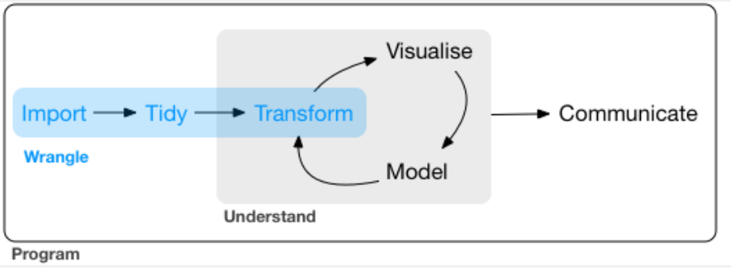
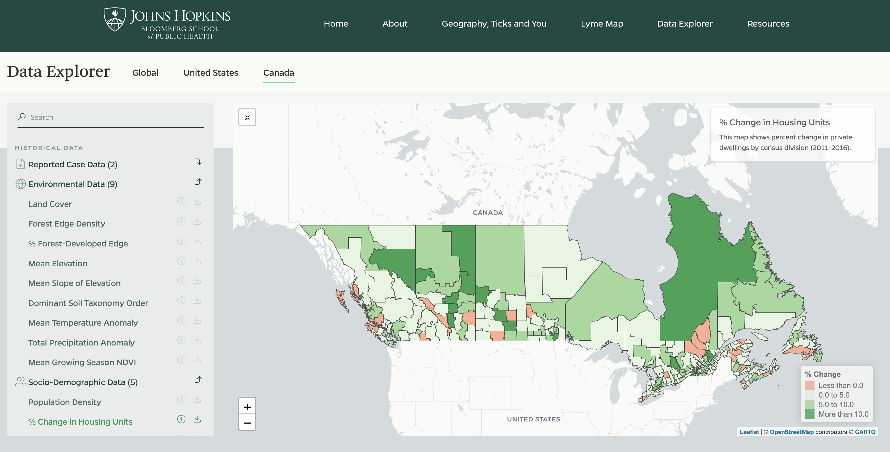
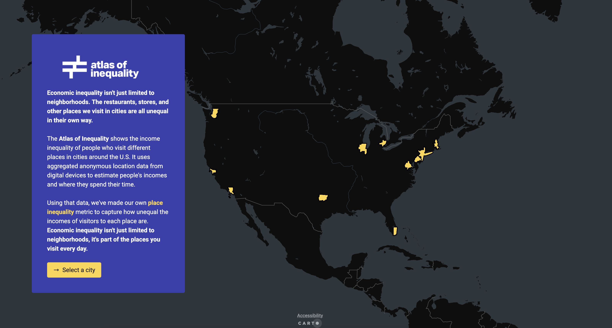

```{python}
#| eval: true
#| include: false
import pandas as pd
import plotly.express as px
import plotly.graph_objects as go
from plotly.subplots import make_subplots
import plotly.io as pio
pio.templates.default = "plotly_white"
pio.templates["plotly_white"].layout.height = 420
```


## What is interactive visualization?

- Interactive visualization involves the creation and sharing of graphical representations of data, model, or results that allow a user to directly manipulate and explore
- Some example products and packages in Python:

. . .

  - Interactive plots (`plotly`)
  - Interactive maps (`plotly`, `folium`)
  - Interactive tables (`plotly` `go.Table`)
  - Dashboards (`dash`, `panel`, `streamlit`)
  - Interactive applications (`shiny for python`, `dash`)
  - Websites (static using `Quarto`, `mkdocs`)

---

## What is interactive visualization?
Interactivity allows users to engage with data / models in a way that static visuals cannot.
Features of interactivity include:

. . .

  - Identify, isolate, and visualize information for extended periods of time
  - Zoom in and out
  - Highlight relevant information
  - Get more information
  - Filter
  - Animate
  - Change parameters

---

## Why use interactive visualization?

Interactive visualization helps with both the **exploration** and **communication** parts of the data science process

{fig-align="center" width="85%"}

---

## Interactive Visualization for *EDA*

Interactive graphics are well suited to aid the exploration of high-dimensional or otherwise complex data. Interacting with information in a visual way helps to enable insights that wouldn't be easy or even possible with static graphics, for reasons including:

(1) **Investigate faster**: In a true exploratory setting, you have to make lots of visualizations, and investigate lots of follow-up questions, before stumbling across something truly valuable. Interactive visualization can aid in the sense-making process by searching for information quickly without fully specified questions.

(2) **Identifying relationships or structure that would otherwise go missing**.

(3) **Understand or diagnose problems with data, models, or algorithms**.

---

## Interactive visualization for *communication*

Interactive graphics are well suited to communicating high-dimensional or otherwise complex data. Interacting with information in a visual way may help communicating data, models, and results for reasons including:

(1) Engagement with information has been shown to improve the ability to retain information

{fig-align="center" width="85%"}


(2) Automate and efficiently share multiple dimensions of data/models/findings or complex analysis tasks

(3) Help users to better understand, and make decisions on, data/models/findings

[{fig-align="center" width="90%"}](https://www.hopkinslymetracker.org/explorer/)

(4) Tell a more interesting or engaging story, presenting multiple viewpoints of data.

(5) Allow users to focus on the aspects most important to them, making the user more likely to understand, learn from, remember, and appreciate the data.

[{fig-align="center" width="85%"}](https://inequality.media.mit.edu/)

---

### Two Classes on Interactive Visualization in Data Science

**Today**:
  - Creating interactive graphs with **`plotly`** for Python and tables with **`go.Table`**
  - Survey options for sharing interactive graphics (Dash apps, dashboards, websites)

**Lab and Next Week**:
  - Create a website using Quarto and GitHub Pages
  - Share your interactive graphics

---


## What is Plotly?

  - [Plotly](https://plotly.com/) is an open source library for creating and sharing interactive graphics.
  - It is powered by the JavaScript graphing library [plotly.js](https://github.com/plotly/plotly.js) and is designed on principles of adding layers (like we saw with plotnine).
  - Plotly can work with several programming languages and applications including Python, R, Matlab.
  - Plotly for Python works seamlessly inside Jupyter notebooks, Quarto documents, Dash apps, and more.

---

## Two ways to build a Plotly figure

Plotly provides two APIs that work together:

| | **Plotly Express** `px` | **Graph Objects** `go` |
|---|---|---|
| Style | High-level, concise | Low-level, explicit |
| Input | DataFrame + column names | Raw arrays / dicts |
| Best for | Quick EDA, standard chart types | Fine-grained control, custom layouts |
| Output | Always a `go.Figure` | A `go.Figure` |

. . .

**Note**: `px` is a *shortcut* — it still produces a `go.Figure` under the hood, so you can always mix both.

---

## Plotly Express (`px`) — the shortcut

`px` builds a complete figure from a DataFrame in one line:

```{python}
#| eval: true
import pandas as pd
import plotly.express as px

df = pd.DataFrame({'x': [1, 2, 3, 4], 'y': [10, 8, 5, 9], 'group': ['A', 'B', 'A', 'B']})
fig = px.scatter(df, x='x', y='y', color='group')
fig.show()
```

. . .

- Column names are passed as **strings** — no `~` operator needed
- Legends, axis labels, and hover tooltips are created **automatically**
- The returned object is a `go.Figure`, so you can keep customizing it

---

## Graph Objects (`go`) — full control

`go` requires you to build every layer explicitly:

```{python}
#| eval: true
import plotly.graph_objects as go

fig = go.Figure()
fig.add_trace(go.Scatter(
    x=[1, 2, 3, 4],
    y=[10, 8, 5, 9],
    mode='markers',
    text=['A', 'B', 'A', 'B']
))
fig.show()
```

. . .

- More verbose, but nothing is hidden — every property is yours to set
- Essential for multi-axis layouts, mixed chart types, or custom trace behavior

---

## They work together seamlessly

Start with `px` for speed, then drop into `go` methods to refine:

```{python}
#| eval: true
fig = px.scatter(df, x='x', y='y', color='group')

# go-style customization on top of a px figure
fig.update_layout(title='My Plot', xaxis_title='X', yaxis_title='Y')
fig.update_traces(marker=dict(size=12, opacity=0.7))
fig.show()
```

. . .

- `.update_layout()` — title, axis labels, legend, hover mode, ...
- `.update_traces()` — marker style, line color, hover template, ...

---

## Load Flights Data

For today's examples we will be using NYC flights data from the `nycflights13` package (from week 4). This includes:

- **Flights**: all flights departing NYC airports (EWR, JFK, LGA) in 2013
- **Weather**: hourly weather observations at each airport
- These are joined and aggregated for use in the examples below

  - `origin`: origin airport (EWR, JFK, LGA)
  - `dest`: destination airport code
  - `month`, `day`, `hour`: time fields
  - `dep_delay`: departure delay (minutes)
  - `arr_delay`: arrival delay (minutes)
  - `pressure`: sea-level pressure (millibars)
  - `wind_speed`: wind speed (mph)
  - `temp`, `dewp`, `humid`, `wind_dir`, `wind_gust`, `precip`, `visib`: other weather variables

---

## Flights Data

```{python}
#| eval: true
#| echo: true
import os
import pandas as pd
import plotly.express as px
from nycflights13 import flights, airports

weather = pd.read_csv('flights_weather.csv')

flights_weather = pd.merge(
    flights, weather, how='left',
    on=['year', 'month', 'day', 'hour', 'origin']
)

agg_cols = ['dep_delay', 'arr_delay', 'temp', 'dewp', 'humid',
            'wind_dir', 'wind_speed', 'wind_gust', 'precip', 'pressure', 'visib']

flights_weather_day = (flights_weather
    .groupby(['year', 'month', 'day', 'origin'])
    .agg({col: 'mean' for col in agg_cols})
    .reset_index())

flight_routes = (flights
    .groupby(['origin', 'dest'])
    .size()
    .reset_index(name='n_flights'))

flight_routes_geo = (flight_routes
    .merge(airports[['faa', 'lat', 'lon', 'name']],
           left_on='dest', right_on='faa', how='inner')
    .rename(columns={'lat': 'dest_lat', 'lon': 'dest_lon', 'name': 'dest_name'})
    .drop(columns=['faa'])
    .merge(airports[['faa', 'lat', 'lon']],
           left_on='origin', right_on='faa', how='inner')
    .rename(columns={'lat': 'origin_lat', 'lon': 'origin_lon'})
    .drop(columns=['faa']))

monthly_delays = (flights_weather_day
    .groupby(['month', 'origin'])[['dep_delay', 'arr_delay']]
    .mean()
    .reset_index())

os.makedirs("input_data", exist_ok=True)
flights_weather_day.to_csv("input_data/flights_weather_day.csv", index=False)

flights_weather_day.head()
```

---

## Basic Scatterplot

Let's start with a scatterplot of humidity (`humid`) vs. departure delay (`dep_delay`) using daily aggregated flights data (`flights_weather_day`). Humidity has a correlation of **+0.48** with departure delay, the strongest weather predictor of delay.

- Use `px.scatter()` and specify `x`, `y`, and `color` column names
- Use `color` to specify an additional data dimension (categorical or continuous), mapping each level to a different color
- `color_discrete_sequence` or `color_continuous_scale` controls the color range
- Scatterplot of humidity vs. departure delay, colored by origin airport
- `plotly` allows us to hover and see the exact $(x,y)$ values of each point
- Notice the automatic `tooltip` that appears when your mouse hovers over each point
- Double click any item in legend to isolate that group in the plot

---

## Basic Scatterplot

```{python}
#| eval: true
fwd = flights_weather_day.dropna(subset=['pressure', 'humid', 'dep_delay', 'wind_speed'])
fig = px.scatter(fwd, x='humid', y='dep_delay',
                 color='origin')
fig.show()
```

---

## Scatterplot: size

- You can add an additional dimension by adjusting the `size` of each point
  - Specify the maximum marker size through `size_max`
  - Set marker `opacity` via `.update_traces()`
- Here we specify size as mapped to each day's `pressure` (atmospheric pressure)

```{python}
fig = px.scatter(fwd, x='humid', y='dep_delay',
                 color='origin', size='wind_speed', size_max=20)
fig.update_traces(marker=dict(opacity=0.5))
fig.show()
```

<br>
<br>

Larger circles represent higher wind speed. 

---

## Specifying hover information

- You can specify what info will appear when hovering using `hovertemplate` in `.update_traces()`
  - Multiple variables can be included via `custom_data`
  - Create new lines between variables in `hovertemplate` using `<br>`
  - Format what you're showing to have reasonable number of decimal places `%{customdata[1]:.1f}`
- Let's add `origin`, `dep_delay`, `humid`, and `wind_speed` to the hover info.


```{python}
fig = px.scatter(fwd, x='humid', y='dep_delay',
                 color='origin', size='wind_speed', size_max=10,
                 custom_data=['origin', 'dep_delay', 'humid', 'wind_speed'])
fig.update_traces(
    marker=dict(opacity=0.5),
    hovertemplate=(
        "Origin: %{customdata[0]}<br>"
        " Dep Delay: %{customdata[1]:.1f} min<br>"
        " Humidity: %{customdata[2]:.1f}%<br>"
        " Wind Speed: %{customdata[3]:.1f} mph<extra></extra>"
    )
)
fig.show()
```

<br>
<br>

We can now clearly understand the information being shown in the `tooltip`

---

## Layout

- Specify chart labels through `.update_layout()`
- `hovermode = "x"` shows all points at the same x position together (default is `"closest"`)
- Note here I have also changed the legend title in `labels` and I have customized the colors with `color_discrete_map`

```{python}
fig = px.scatter(fwd, x='humid', y='dep_delay',
                 color='origin', size='wind_speed', size_max=15,
                 title="Departure Delay vs. Humidity by Origin Airport",
                 labels={'dep_delay': 'Departure Delay (min)', 'humid': 'Humidity (%)', 'wind_speed': 'Wind Speed (mph)', 'origin': 'Airport'},
                 color_discrete_map={
                'EWR': 'blue',
                'JFK': 'coral',
                'LGA': 'green'},
                 custom_data=['origin', 'dep_delay', 'humid', 'wind_speed'])
fig.update_traces(
    marker=dict(opacity=0.5),
    hovertemplate=(
        "Origin: %{customdata[0]}<br> Dep Delay: %{customdata[1]:.1f} min<br>"
        " Humidity: %{customdata[2]:.1f}%<br> Wind Speed: %{customdata[3]:.1f} mph<extra></extra>"
    )
)
fig.update_layout(hovermode="closest")
fig.show()
```

---

## 3D Scatterplot

- Can add a 3rd dimension using `px.scatter_3d()` (make sure to specify the `z` column)
- Useful for exploring three numeric variables simultaneously

```{python}
fig = px.scatter_3d(fwd, x='humid', y='dep_delay', z='wind_speed',
                    color='origin', size='wind_speed', size_max=20,
                    title="Departure Delay, Humidity, and Visibility by Origin Airport",
                    labels={'dep_delay': 'Departure Delay (min)',
                            'humid': 'Humidity (%)',
                            'visib': 'Visibility (miles)',
                            'wind_speed': 'Wind Speed (mph)',
                            'origin': 'Airport'},
                    custom_data=['origin', 'dep_delay', 'humid', 'wind_speed'])
fig.update_traces(
    marker=dict(opacity=0.6),
    hovertemplate=(
        "Origin: %{customdata[0]}<br> Dep Delay: %{customdata[1]:.1f} min<br>"
        " Humidity: %{customdata[2]:.1f}%<br> Wind Speed: %{customdata[3]:.1f} mph<extra></extra>"
    )
)
fig.show()
```

---

## Scatterplot with `px.scatter()` trendline

- You can create a scatterplot with a trendline using the `trendline` argument in `px.scatter()`
- The advantage is that it allows seeing the pattern in the scatter with `trendline='lowess'` (analogous to `geom_smooth()`)


```{python}
fig = px.scatter(fwd, x='humid', y='dep_delay',
                 size='wind_speed', color='origin', trendline='ols')
fig.show()
```

<br>
<br>

The trendline confirms a positive relationship between humidity and departure delays — higher humidity (fog, rain, snow conditions) is associated with longer delays across all three airports.

---

## Annotations

- You can add annotations to your interactive plot using `.add_annotation()`

```{python}
fig = px.scatter(fwd, x='humid', y='dep_delay',
                 size='wind_speed', color='origin', trendline='ols')

max_row = fwd.loc[fwd['dep_delay'].idxmax()]
min_row = fwd.loc[fwd['dep_delay'].idxmin()]

fig.add_annotation(x=max_row['humid'], y=max_row['dep_delay'],
                   text=f"Highest Delay: {max_row['origin']}",
                   showarrow=True, arrowhead=1)
fig.add_annotation(x=min_row['humid'], y=min_row['dep_delay'],
                   text=f"Lowest Delay: {min_row['origin']}",
                   showarrow=True, arrowhead=1)
fig.show()
```

---

## Line graph

- Use `px.line()` to specify a line plot
- Be sure to specify the feature (column in the data) that distinguishes the lines (normally through `color`)
- We use `monthly_delays` which shows mean departure delay by month and origin airport

```{python}
fig = px.line(monthly_delays, x='month', y='dep_delay', color='origin',
              custom_data=['month', 'origin', 'dep_delay'])
fig.update_traces(
    hovertemplate=(
        "Month: %{customdata[0]}<br>"
        "Origin: %{customdata[1]}<br>"
        " Dep Delay: %{customdata[2]:.1f} min<extra></extra>"
    )
)
fig.show()
```

Departure delays tend to peak in summer months (June–July) across all three NYC airports, with a secondary spike around the December holidays.

It helps to be able to see the exact values for each month upon hover.

---

## Line graph: subplots

- `make_subplots()` can be used to arrange multiple plots
  - Compare the automatic `tooltip` results for both plots

```{python}
from plotly.subplots import make_subplots

fig1 = px.line(monthly_delays, x='month', y='dep_delay', color='origin')
fig2 = px.line(monthly_delays, x='month', y='arr_delay', color='origin')

combined = make_subplots(rows=1, cols=2,
                         subplot_titles=["Departure Delay", "Arrival Delay"])
for trace in fig1.data:
    combined.add_trace(trace, row=1, col=1)
for trace in fig2.data:
    trace.showlegend = False
    combined.add_trace(trace, row=1, col=2)
combined.update_layout(template='plotly_white')
combined.show()
```

---

## Specifying text with `px.line()`

- You can specify the tooltip text using `hovertemplate` in `.update_traces()`

```{python}
fig = px.line(monthly_delays, x='month', y='arr_delay', color='origin',
              custom_data=['month', 'origin', 'arr_delay'])
fig.update_traces(
    hovertemplate=(
        "Month: %{customdata[0]}<br>"
        "Origin: %{customdata[1]}<br>"
        "Arr Delay: %{customdata[2]:.1f} min<extra></extra>"
    )
)
fig.show()
```

---

## Histograms

- Use `go.Histogram()` to overlay multiple distributions on the same plot
- Set `barmode='overlay'` and `opacity` so both traces are visible
- `nbinsx` controls the number of bins

```{python}
fig = go.Figure()

fig.add_trace(go.Histogram(
    x=flights_weather_day['dep_delay'].dropna(),
    name='Departure Delay',
    nbinsx=30,
    opacity=0.7,
    hovertemplate=
        "Type: Departure Delay<br>" +
        "Delay bin: %{x}<br>" +
        "Count: %{y}<extra></extra>"
))

fig.add_trace(go.Histogram(
    x=flights_weather_day['arr_delay'].dropna(),
    name='Arrival Delay',
    nbinsx=30,
    opacity=0.7,
    hovertemplate=
        "Type: Arrival Delay<br>" +
        "Delay bin: %{x}<br>" +
        "Count: %{y}<extra></extra>"
))

fig.update_layout(
    barmode='overlay',
    title='Distribution of Departure and Arrival Delays',
    xaxis_title='Delay (min)',
    yaxis_title='Count'
)

fig.show()
```

---

## Heatmap

- Heatmaps are useful for displaying three dimensional data in two dimensions, using color for the third dimension.
- To create a heatmap from a dataframe we first have to pivot the data to a matrix using `pandas.pivot()`
  - Here we are choosing `month`, `origin`, and mean `dep_delay`

- We can then create a heatmap using `px.imshow()`
- Use `color_continuous_scale` to set the color palette
- Axes will automatically show origin airports and months

```{python}
heatmap_data = (flights_weather_day
    .groupby(['month', 'origin'])['dep_delay']
    .mean()
    .reset_index())

heatmap_pivot = heatmap_data.pivot(index='month', columns='origin', values='dep_delay')

fig = px.imshow(
    heatmap_pivot,
    color_continuous_scale='Reds',
    title='Mean Departure Delay by Month and Origin Airport',
    labels={
        'x': 'Origin Airport',
        'y': 'Month',
        'color': 'Mean Delay (min)'
    }
)

fig.update_traces(
    hovertemplate=(
        "Month: %{y}<br>"
        "Origin: %{x}<br>"
        "Mean Departure Delay: %{z:.1f} min<extra></extra>"
    )
)

fig.show()
```

<br>

Departure delays peak in summer months (June–July) across all three airports, with a secondary spike in December. The hover info lets us inspect the exact month and delay value for each airport.

---

## 3D Surface

You can also create a 3D surface out of the matrix using `go.Surface()`
- The same heatmap pivot (month × origin) can be rendered as a 3D surface

```{python}
fig = go.Figure(data=[go.Surface(
    z=heatmap_pivot.values,
    x=list(heatmap_pivot.columns),
    y=[str(m) for m in heatmap_pivot.index],
    colorscale='Reds',
    showscale=True,
    hovertemplate=(
        "Origin: %{x}<br>"
        "Month: %{y}<br>"
        "Mean Departure Delay: %{z:.1f} min<extra></extra>"
    )
)])

fig.update_layout(
    title='Mean Departure Delay by Month and Origin Airport',
    scene=dict(
        xaxis_title='Origin Airport',
        yaxis_title='Month',
        zaxis_title='Departure Delay (min)'
    )
)

fig.show()
```

From this plot we can see that EWR has longer delays relative to the other two airports.

---

## Interactive Map: Flight Routes

`px.scatter_geo()` places markers at geographic coordinates — perfect for plotting airport destinations.

- `lat` and `lon` come from `flight_routes_geo` (destination airport coordinates)
- `color='origin'` distinguishes the three NYC origin airports
- `size='n_flights'` scales each dot by the number of flights to that destination
- `scope='usa'` zooms the map to the continental US


```{python}
fig = px.scatter_geo(flight_routes_geo,
                     lat='dest_lat', lon='dest_lon',
                     color='origin',
                     size='n_flights', size_max=20,
                     scope='usa',
                     hover_name='dest',
                     hover_data={'n_flights': True, 'dest_lat': False, 'dest_lon': False},
                     title='NYC Flight Destinations by Origin Airport')
fig.show()
```

Larger circles indicate more flights to that destination. Hover over any airport to see its code and number of flights from each NYC origin.

---

## A note on interactive mapping
- There are multiple ways to render interactive maps with plotly: `px.choropleth()`, `px.scatter_geo()`, `px.scatter_mapbox()`, and `px.choropleth_mapbox()`.
- `plotly` is a general purpose visualization library and doesn't offer the most fully featured geo-spatial visualization toolkit. If you run into limitations with plotly's mapping functionality there are many other tools for interactive geospatial visualization in Python, including: **folium**, **ipyleaflet**, **keplergl**, and **pydeck**.


---

## Interactive tables

`plotly.graph_objects` has a built-in `go.Table` for interactive tables — no extra package needed

- Note that you can scroll through rows and hover over cells to inspect values

```{python}
top_routes = (flight_routes_geo[['origin', 'dest', 'dest_name', 'n_flights']]
    .sort_values('n_flights', ascending=False)
    .head(50))
fig = go.Figure(data=[go.Table(
    header=dict(
        values=['Origin', 'Destination', 'Destination Name', 'Number of Flights'],
        align='left',
        fill_color='white',
        line_color='lightgrey',
        font=dict(color='black', size=13)
    ),
    cells=dict(
        values=[top_routes[col] for col in top_routes.columns],
        align='left',
        fill_color='white',
        line_color='lightgrey',
        font=dict(color='black', size=12)
    )
)])
fig.show()
```


# Dashboards

---

## What is a dashboard?

A **dashboard** is an interactive web application that lets users explore data in real time — without writing any code.

. . .

- Unlike a static report or a Quarto slide deck, dashboards respond to user input: dropdowns, sliders, checkboxes, date pickers
- The application re-runs logic and re-renders plots whenever a user changes a control
- Deployed as a web app that anyone can use in a browser

. . .

**When to use a dashboard instead of a Quarto document**

| | Quarto / notebook | Dashboard |
|---|---|---|
| Audience | Technical readers | Anyone |
| Interactivity | Plotly hover / zoom | Full user controls |
| Deployment | Static HTML | Running server |
| Update frequency | Re-render file | Live |

---

## Python dashboard tools

All four major tools work well with **plotly** figures:

. . .

- **Dash** (by Plotly) — closest to a full web framework; very flexible; React under the hood
- **Streamlit** — simplest to learn; great for prototyping; script runs top-to-bottom on every interaction
- **Panel** (HoloViz) — works with many plotting libraries; good for Jupyter-native workflows
- **Shiny for Python** — R Shiny's Python port; familiar if you know Shiny

. . .

We'll focus on **Dash** and **Streamlit** as they are the most widely used in data science.

---


## Dash: concepts

Dash apps have three building blocks:

. . .

**1. Layout** — describes what the app looks like, using HTML and Dash Core Components:

```python
from dash import Dash, dcc, html
app = Dash()
app.layout = html.Div([
    html.H1("My Dashboard"),
    dcc.Dropdown(id='my-dropdown', options=[...]),
    dcc.Graph(id='my-graph')
])
```

. . .

**2. Callbacks** — Python functions that run automatically when an input changes:

```python
from dash import Input, Output

@app.callback(Output('my-graph', 'figure'),
              Input('my-dropdown', 'value'))
def update_graph(selected_value):
    ...
    return fig
```

. . .

**3. `app.run()`** — starts a local web server (default: `http://127.0.0.1:8050`)

---

## Dash: minimal example

Save this as `dash_app.py` and run with `python dash_app.py` (make sure to install dash `python3 -m pip install dash`):

```python
#| eval: false
#| echo: true
from dash import Dash, dcc, html, Input, Output
import plotly.express as px
import pandas as pd

flights_weather_day = pd.read_csv("input_data/flights_weather_day.csv")
monthly_delays = (flights_weather_day
    .groupby(['month', 'origin'])[['dep_delay', 'arr_delay']]
    .mean().reset_index())

app = Dash()

app.layout = html.Div([
    html.H1("NYC Flight Delay Explorer"),
    dcc.Dropdown(
        id='origin-dd',
        options=[{'label': o, 'value': o}
                 for o in sorted(monthly_delays['origin'].unique())],
        value='JFK',
        clearable=False
    ),
    dcc.Graph(id='line-chart')
])

@app.callback(Output('line-chart', 'figure'),
              Input('origin-dd', 'value'))
def update(origin):
    df = monthly_delays[monthly_delays['origin'] == origin]
    return px.line(df, x='month', y='dep_delay',
                   title=f'Monthly Departure Delay — {origin}',
                   labels={'dep_delay': 'Avg Dep Delay (min)', 'month': 'Month'})

if __name__ == '__main__':
    app.run(debug=True)
```

---

## Dash: adding a range slider

Add a `dcc.RangeSlider` to filter by month using the full daily data:

```python
#| eval: false
#| echo: true
app.layout = html.Div([
    html.H1("NYC Flight Delays by Month"),
    dcc.RangeSlider(
        id='month-slider',
        min=1, max=12, step=1, value=[1, 12],
        marks={m: str(m) for m in range(1, 13)}
    ),
    dcc.Graph(id='line-chart')
])

@app.callback(Output('line-chart', 'figure'),
              Input('month-slider', 'value'))
def update(month_range):
    df = monthly_delays[monthly_delays['month'].between(*month_range)]
    return px.line(df, x='month', y='dep_delay', color='origin',
                   title='Mean Departure Delay by Origin Airport')
```

---

## Dash: key ideas

. . .

- **Inputs and Outputs** are linked by component `id` strings — the callback fires whenever any `Input` changes
- Multiple inputs → one output, or one input → multiple outputs are both supported
- `dcc` (Dash Core Components) provides dropdowns, sliders, graphs, date pickers, text input, etc.
- `html` mirrors standard HTML tags: `html.Div`, `html.H1`, `html.P`, `html.Button`
- Layout is pure Python — no HTML/CSS files needed (though CSS can be added)
- Deploy with **Render**, **Railway**, **Heroku**, or any server that can run Python

---


## Streamlit: concepts

Streamlit is designed to turn a Python script into a web app with minimal boilerplate.

. . .

- No explicit layout objects or callback decorators — just write Python top-to-bottom
- Every time the user interacts with a widget, the **entire script re-runs** from the top
- `st.cache_data` caches expensive computations across re-runs

. . .

```python
#| eval: false
import streamlit as st

st.title("My App")
x = st.slider("Pick a number", 0, 100, 50)  # widget — returns current value
st.write(f"You picked {x}")                  # rendered immediately
```

Run with: `streamlit run streamlit_app.py`

---

## Streamlit: minimal example

```python
#| eval: false
#| echo: true
import streamlit as st
import plotly.express as px
import pandas as pd

@st.cache_data
def load_data():
    df = pd.read_csv("input_data/flights_weather_day.csv")
    return df

flights_weather_day = load_data()
monthly_delays = (flights_weather_day
    .groupby(['month', 'origin'])[['dep_delay', 'arr_delay']]
    .mean().reset_index())

st.title("NYC Flight Delay Explorer")

origin = st.selectbox(
    "Select an origin airport",
    sorted(monthly_delays['origin'].unique())
)

df = monthly_delays[monthly_delays['origin'] == origin]

fig = px.line(df, x='month', y='dep_delay',
              title=f'Monthly Departure Delay — {origin}',
              labels={'dep_delay': 'Avg Dep Delay (min)', 'month': 'Month'})
st.plotly_chart(fig, use_container_width=True)
```

---

## Streamlit: adding more controls

Streamlit widgets are single lines — add as many as you need:

```python
#| eval: false
#| echo: true
min_humid = st.slider("Minimum humidity (%)",
                      min_value=0, max_value=100, value=0)

show_trendline = st.checkbox("Show trendline", value=True)

fwd = flights_weather_day.dropna(subset=['humid', 'dep_delay'])
df = fwd[
    (fwd['origin'] == origin) &
    (fwd['humid'] >= min_humid)
]

fig = px.scatter(df, x='humid', y='dep_delay',
                 color='origin',
                 trendline='ols' if show_trendline else None,
                 title=f'Humidity vs Departure Delay — {origin}')
st.plotly_chart(fig, use_container_width=True)
```

---

## Dash vs. Streamlit

|  | Dash | Streamlit |
|--|------|-----------|
| **Learning curve** | Steeper | Gentle |
| **Reactivity model** | Callbacks (explicit) | Full re-run (implicit) |
| **Layout control** | Full (HTML + CSS) | Limited but fast |
| **Performance** | Better for complex apps | Can be slow with many widgets |
| **Best for** | Production apps, fine-grained control | Prototyping, data science demos |
| **Deployment** | Any Python server | Streamlit Community Cloud (free) |

. . .

Both can embed **any plotly figure** with a single line.
Start with Streamlit to get something working quickly; switch to Dash if you need more control.

Check out this [flights app](https://group8-flightsproject-vu.streamlit.app/Flight_Routes) that uses streamlit!

---

## Publishing Plotly views

Both `px.*()` and `go.Figure()` objects render directly in Quarto HTML output, so interactive Plotly figures can appear in Quarto documents, slides, and websites published with GitHub Pages or other hosting platforms.  

In practice, you have three common ways to share a Plotly visualization:

    - render it directly inside a Quarto page
    - Save it as a standalone interactive HTML file
    - Export it as a static image for slides, PDFs, or print

---

## Rendering in Quarto

If a Plotly figure is the output of a code cell in Quarto, it will appear directly in the rendered HTML document.

For a single self-contained Quarto HTML file, use:

```yaml
format:
  html:
    embed-resources: true
```

This embeds document resources into the HTML, making the file easier to share as one standalone page.

## Saving as interactive HTML

Any plotly figure can be saved as a standalone HTML file via `fig.write_html()`. By default, it produces a completely self-contained HTML file, meaning that all the necessary JavaScript and CSS dependency files are bundled inside the HTML file.

- `include_plotlyjs=True` (default) creates a self-contained file
- `include_plotlyjs="cdn"` creates a smaller file, but it requires internet access to load Plotly JavaScript
- `include_plotlyjs="directory"` or a .js path can be useful when many HTML files share the same dependency file 

```{python}
#| eval: false
import plotly.express as px

fig = px.scatter(x=[1, 2, 3], y=[4, 5, 6])

fig.write_html("p1.html")   # standalone HTML
fig.write_html("p2.html", include_plotlyjs="cdn")  # smaller file, needs internet
```

---

## Saving a static image

Any **plotly** figure can be saved as a static image via `fig.write_image()` (requires the `kaleido` package).

You can export to formats such as PNG, JPEG, SVG, and PDF. Kaleido is the recommended export engine.

```{python}
#| eval: false
import plotly.express as px

fig = px.scatter(x=[1, 2, 3], y=[4, 5, 6])
fig.write_image("myplot.svg", width=600, height=700)
```

---

## Saving from the browser

When viewing a Plotly figure in the browser, the modebar includes a download button that saves the figure as a PNG by default.

You can also customize aspects of the figure display, such as the modebar layout:

```{python}
#| eval: false
fig.update_layout(
    modebar=dict(orientation="v")
)
```

---


## Takeaways

Hopefully in this class you have learned:
- How to create plots with **plotly** using either `go.Figure()` calls or `px.*()` from plotly express
- Other interactive options — maps, tables (`go.Table`), animated plots
- How to build interactive dashboards with **Dash** or **Streamlit**
- To appreciate how interactive visualization can help to explore data in ways static graphics cannot
- Get an idea of the multitude of options available to you
- Get inspired to create engaging, effective data visualizations and tell stories with your data and findings!

---

## Avoid pitfalls

- Don't overcomplicate!
- Only use when adding value!
- Some examples of bad practices: [(link)](https://badvisualisations.tumblr.com/)
- And just hilariously bad examples: [(link)](https://viz.wtf/)

---

## More Resources

`Plotly`

- [Plotly Python Reference](https://plotly.com/python/reference)
- [The Plotly Python API](https://plot.ly/python/)
- [The Plotly Python Package on GitHub](https://github.com/plotly/plotly.py)
- [Plotly Express documentation](https://plotly.com/python/plotly-express/)
- ["Interactive Data Visualization with Python"](https://plotly.com/python/getting-started/)


`Dash` and dashboards

- [The `Dash` Website](https://dash.plotly.com)
- [Panel for Python Dashboards](https://panel.holoviz.org)
- [Streamlit for Data Apps](https://streamlit.io)

Website development in Quarto

- [Quarto Websites](https://quarto.org/docs/websites/)
- [Tutorial: Creating websites with Quarto](https://quarto.org/docs/websites/website-blog.html)
- [Advanced site creation with Quarto and GitHub Pages](https://quarto.org/docs/publishing/github-pages.html)

Data visualization best practices

- [Data Visualization: A Practical Introduction](https://kieranhealy.org/publications/dataviz/), Kieran Healy
