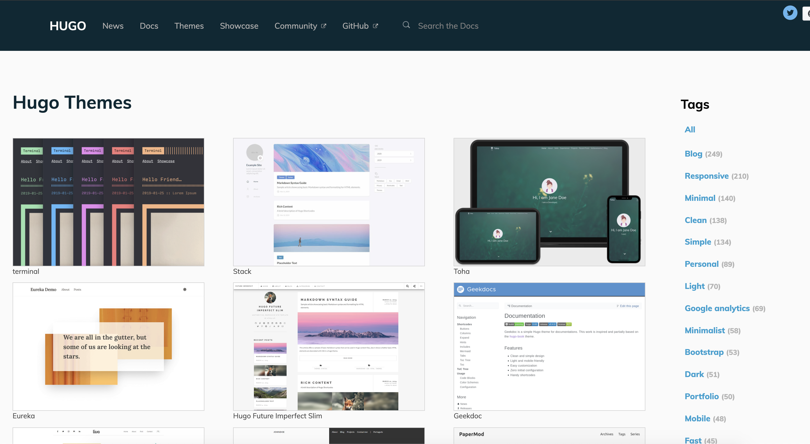

## This week

- We will build static websites using Quarto and GitHub Pages. We will learn how to render text, code, visuals, and interactive visuals  on the website.


- To understand how websites are built in Quarto, we first must understand a bit about how Quarto documents are rendered to produce HTML output.

- It is not essential to understand all the inner workings of this process to be able to create a website. However, it is important to understand which component is responsible for what since this will make it easier to target appropriate help files when you need them!

---

## What does Quarto require to render files?

Quarto combines several different processes together to create documents. The basic workflow structure for a Quarto document:

```
.qmd → (jupyter) → .md → (Pandoc) → HTML / PDF / etc.
```

. . .

- Quarto: A publishing system built on **Pandoc**, supporting Python, R, Julia, and Observable JS.

- **jupyter**: Executes Python code chunks and weaves results back into the document.

- **[Pandoc](https://pandoc.org/)**: A "universal" document converter that converts files between numerous formats including Markdown into HTML, PDF, Word, and many other formats.

- Pandoc comes bundled with Quarto (no separate install needed).

---


## What happens when we render Quarto?

Rendering Quarto documents consists of:

1. Executing Python code chunks with **jupyter** to produce an intermediate `.md`
2. Converting `.md` to the desired output format with Pandoc

The workflow in more detail:

- The `.qmd` document contains YAML metadata, text (Markdown), and code chunks.
- **jupyter** executes all Python code and embeds results, producing a temporary `.md` file.
- Pandoc processes the `.md` file, applying the output format and any templates or themes specified in the YAML.

3. The YAML `format:` field (e.g., `html`, `revealjs`, `pdf`) determines the output.
4. The whole process is invoked via `quarto render` (CLI) or the **Render** button in VS Code.

Along the way, we add structure and style. A wide range of tools helps us in this process — including *Cascading Style Sheets (CSS)*, raw HTML, and Pandoc/Quarto templates.

---

## YAML metadata

YAML = <s>Yet Another Markup Language</s> YAML Ain't Markup Language

It is a data-oriented *language structure* used as the input format for diverse software applications. It is not a markup language but a *serialization* language — it converts objects into a transmittable/storable format (a series of bits) that can later be reconstructed.

---

## YAML metadata

A typical Quarto YAML header:

```yaml
---
title: My Quarto Website
author: Meredith Franklin
format: html
---
```

The YAML metadata affects the code, content, and the output. It is processed by **jupyter**, Quarto, and Pandoc.

- The `title` and `author` fields are processed by Pandoc to set template variables.

- The `format` field is used by Quarto to determine the output format and apply the appropriate rendering pipeline.

---

## Beyond Pandoc

Note that not all Quarto documents are processed identically. Some output formats use JavaScript rendering in the browser:

- **revealjs** slides (like these!) pass Markdown content to the Reveal.js JavaScript library, which renders slides in the web browser.
- **Observable JS** chunks run directly in the browser, enabling reactive data visualizations without a server.
- **Hugo** is a popular standalone static site generator that builds sites from `.md` files with no language runtime required.

---

## Summary: Rendering Quarto


In short: `quarto render` = code execution (jupyter) + Pandoc

. . .

The YAML metadata in the Quarto file dictates the process and how the output is produced.

---

## Website basics

The most common components of a web page are HTML, CSS, and JavaScript. HTML is relatively simple to learn, but CSS and JavaScript can be much more complicated, depending on how much you want to learn and what you want to do with them.

You don't need to know much of HTML, CSS, or JavaScript to develop a website using Quarto. If you want to tweak the appearance of your website, you must have some basic knowledge of web development.

---

## HTML basics

HTML = Hyper Text Markup Language. HTML is a standard markup language (not programming language) that provides the primary structure of most websites.

HTML defines the basic structure of a web page. HTML pages are static — the content is not dynamically computed on load.

All elements in HTML are represented by tags. Most HTML tags appear in pairs, e.g., `<span style="background-color: #33FF99">highlighted text</span>` → <span style="background-color: #33FF99">highlighted text</span>.

---

## HTML basics

There are a few exceptions, such as the `` tag, which can be self-closed: ``.

An HTML document consists of a `head` section (metadata, CSS links) and a `body` section (content).

You can inspect HTML and CSS in your browser: right-click → **View Source** or **Inspect**.

---

## Helpful HTML

Font size and color:
`<font size="3" color="red">Text here!</font>`

Columns:
`<div class="col2"> ... </div>`

Centered text:
`<center>**Here the text is centered.**</center>`

Small image right-aligned:
`<div align="right"></div>`

Large image centered:
`<center></center>`

---

## CSS basics

CSS = Cascading Stylesheets. It describes the visual style of HTML documents:

- Color palettes
- Images
- Layouts / margins
- Fonts

as well as interactive components like drop-down menus, buttons, and forms.

---

## CSS basics

There are 3 ways to define styles:

- In-line with HTML
- Placing a `<style>` section in your HTML document
- Define CSS in an external file referenced as a `<link>` in your HTML (most flexible)

---

## JavaScript

JavaScript is a programming language (unlike HTML and CSS) that makes web pages **interactive and dynamic**.

As a data scientist building a Quarto website, **you rarely write JavaScript directly**. Instead, Python libraries generate it for you:

- `plotly` → outputs a `<script>` block that renders your chart interactively
- `itables` → outputs JS that makes your table sortable and searchable
- Dash/Streamlit → JS handles the reactive UI in the browser

---

## JavaScript: what you need to know

You don't need to write JS, but it helps to know:

- Interactive HTML widgets on your site **require JS to be enabled** in the browser
- The `<script>` tags you see in your rendered HTML are JavaScript
- If a plot isn't rendering, check the browser console for JS errors:
  - Chrome/Edge: `Cmd+Option+J` (Mac) or `F12` → **Console** tab
  - Firefox: `Cmd+Option+K` (Mac) or `F12` → **Console** tab

. . .

For learning more: [javascript.info](https://javascript.info/) is a clear reference.

---


## Background: Static vs. dynamic websites

A _dynamic site_ relies on a server-side language (e.g., PHP, Node.js) to compute and send potentially different content depending on conditions — for example, serving a personalized user profile page fetched from a database.

A _static site_ consists of static files (HTML, CSS, JavaScript, images), and the web server sends exactly the same content to every visitor. *It is just one folder of static files.*

---

## Creating websites with Quarto

**Quarto** has a built-in static site generator (`project: type: website`), which we will be using. It supports Bootstrap CSS themes as well as custom CSS.

. . .

There are many existing static site generators, including Hugo, Jekyll, and Hexo. These provide many site themes, templates, and features, but are more complex.

. . .

Quarto's built-in site generator is a good option if:

- You are familiar with generating single-page HTML output from `.qmd` files (what we have been doing all semester!)
- You want to build a simple website with a few pages
- It suffices to use a flat directory of `.qmd` files
- You don't require features such as forums or RSS feeds

---

## Creating websites with Quarto

We render Quarto websites using `quarto render` from the project directory, or the **Render** button in VS Code.

. . .

VS Code with the Quarto extension provides integrated support for Quarto projects, including preview and build, tied to a `_quarto.yml` configuration file.

. . .

We will use VS Code and the command line to build our websites, and deploy them on GitHub Pages.

---

## Overview

There are two main steps for creating a personal website hosted on GitHub:

- Create website through local setup
- Deploy website through GitHub setup

---

## Overview: Local Setup

1. Create a project directory with a `_quarto.yml` file
1. Create `index.qmd` in your new directory
1. Add additional pages as other `.qmd` files
1. Edit files to create content and manage layout
1. Add a stylesheet (`styles.css`) if desired
1. Build the website:
    - `quarto render` in the terminal, or
    - **Preview** in VS Code with the Quarto extension

This creates the output: `_site/index.html` (or `index.html` if `output-dir: "."`)

. . .

Let's break this down, focusing on the essential content.

---

## Essential elements

The minimum requirement for any Quarto website is an `index.qmd` and a `_quarto.yml` file.

Let's walk through a very simple example: a website with two pages (`Home` and `About`) and a navigation bar.

---

## A simple example

First, the configuration file `_quarto.yml`:

```yaml
project:
  type: website

website:
  title: "My Website"
  navbar:
    left:
      - text: "Home"
        href: index.qmd
      - text: "About"
        href: about.qmd
```

---

## A simple example (cont'd)

Then two Quarto files, `index.qmd`:

```markdown
---
title: "My Website"
---

Hello, Website!
```

and `about.qmd`:

```markdown
---
title: "About This Website"
---

More about this website.
```

---

## Common elements

Now let's discuss the essential `_quarto.yml`, the `index.qmd`, and other common elements.

Typically when creating a website, there are various common elements you want to include on all pages (output options, CSS styles, header and footer elements, etc.).

---

## Common elements: `_quarto.yml`

A more detailed `_quarto.yml`:

::: {.smaller}
```yaml
project:
  type: website
  output-dir: "."

website:
  title: "My Website"
  navbar:
    left:
      - icon: fa-home
        href: index.qmd
      - text: "About"
        href: about.qmd
    right:
      - text: "External website"
        href: https://www.google.com
  page-footer:
    center: "Copyright 2026"

format:
  html:
    theme: cosmo
    highlight-style: textmate
    include-after-body: footer.html
    css: styles.css
```
:::

---

## Common elements: `_quarto.yml`

- The `title` field under `website:` sets the site/navbar title.

. . .

- The `output-dir` field indicates which directory to copy site content into (`"_site"` is the default). Set to `"."` to keep content alongside source files.

. . .

- The `format:` element defines shared output options for all `.qmd` documents. Individual documents can override these by specifying their own `format:` block, which is merged at render time.

. . .

- As part of our common output options, we can specify an HTML footer, a CSS stylesheet, and other HTML includes.

---

## `self-contained`: single doc vs. website

For a **single** `.qmd` document (e.g., a homework), `self-contained: true` bundles all JS/CSS into one portable HTML file — useful for emailing or submitting.

For a **website**, Quarto automatically sets `self-contained: false`. This means:

- JS/CSS libraries (e.g., plotly.js) are written once to `site_libs/` and **shared** across all pages
- Each page loads them from that shared folder rather than re-embedding them

. . .

**Why this matters:** if you forced `self-contained: true` on a website, every page would duplicate the same multi-MB libraries — making the site very large. With `false`, plotly.js is downloaded once by the browser and cached for all your pages.

---

## `_quarto.yml`: `navbar`

The `navbar` element can be used to define a common navigation bar. You can include internal and external links as well as drop-down menus for sites with many pages.

Some capabilities of navigation bars:

- Choose between `dark` and `light` navigation bar colors.

. . .

- Align navigational items to the `left` or `right`.

. . .

- Include both internal links (`.qmd` files) and external links.

---

## `_quarto.yml`: `navbar`

- Use icons on the navigation bar. Quarto supports:
    - [Bootstrap Icons](https://icons.getbootstrap.com/) (e.g., `github`, `twitter`, `house`)
    - [Font Awesome](https://fontawesome.com/icons) (prefix with `fa-`)

When referring to an icon, use its name (e.g., `icon: github`, or `icon: fa-github`).

---

## Common elements: other

- Include a footer via `_quarto.yml`:

    ```yaml
    website:
      page-footer:
        center: "Copyright &copy; 2026 My Name"
    ```
    Or via an HTML file referenced as `include-after-body: footer.html`.

- Style sheets: `styles.css`

    ```css
    blockquote {
      font-style: italic;
    }
    ```

---

## Rendering and building the site

As you work on individual pages, you can render them with the **Render** button (or `quarto render index.qmd`) just as you would a standalone Quarto document.

Rendering an individual page only renders and previews that page, not the entire site.

To render all pages, use `quarto render` from the project root, or the **Build** pane in VS Code.

---

## Rendering and building the site (cont'd)

VS Code with the Quarto extension supports live preview of changes to `.qmd` files, CSS, and configuration files.

Changes to CSS and YAML config files trigger a refresh of the active page. Changes to `.qmd` files trigger a rebuild of that page.

**Note**: After editing shared files or configuration, rebuild the entire site to ensure all pages reflect your changes.

---

## Rendering and building the site: command line

From the terminal, run `quarto render` to render the entire site, or pass a single file to render just that file:

```bash
# render the entire site
quarto render

# render a single file only
quarto render about.qmd

# preview with live reload
quarto preview
```

---

## Rendering and building the site: command line

If you run `quarto render` from the project directory:

- All `.qmd` files in the project root are rendered to HTML.
- Files beginning with `_` are not rendered (they are treated as includes/partials).
- The generated HTML files and supporting files (CSS, JS) are copied to the output directory (`_site` by default).
- The `_site` directory contains a standalone static website ready to deploy.

**Note**: The `includes` and `excludes` fields of `_quarto.yml` can override this behavior.

---

# Helpful features

---

## Quarto website themes

Quarto makes styling easy. The HTML output includes the Bootstrap framework with multiple themes to choose from.

We can change the website's theme in `_quarto.yml`:

```yaml
format:
  html:
    theme: cosmo
```

Valid built-in themes include: `default`, `cerulean`, `cosmo`, `cyborg`, `darkly`, `flatly`, `journal`, `litera`, `lumen`, `lux`, `materia`, `minty`, `morph`, `pulse`, `quartz`, `sandstone`, `simplex`, `sketchy`, `slate`, `solar`, `spacelab`, `superhero`, `united`, `vapor`, `yeti`, `zephyr`.

---

## Shared Python modules

If you have Python code to share across multiple `.qmd` documents, put it in a module and import it:

```python
# shared_utils.py
import pandas as pd

def load_data():
    return pd.read_csv("data.csv")
```

```{python}
#| eval: false
from shared_utils import load_data
df = load_data()
```

---

## Adding interactive content

Quarto supports rich interactive Python content:

- **plotly**, **altair**, **bokeh** figures render as interactive HTML automatically
- **itables** / **great_tables** for interactive tables
- **Observable JS**: reactive computations that run directly in the browser
- **Dash** / **Streamlit**: full apps (require a server, see the dashboard section)

For many Quarto websites, *you will not need to worry about generating HTML output at all* — it is created automatically from your Python code.

---

## Saving interactive plots as HTML widgets

If you have issues embedding interactive plots, save them as standalone HTML widgets using **htmlwidgets**:

```python
import plotly.express as px
fig = px.scatter(df, x="x", y="y")
fig.write_html("my_plot.html")
```

Then embed via an `<iframe>`:

```html
<iframe src="my_plot.html" width="100%" height="500px"></iframe>
```

---

## Adding dynamic content

To add dynamic, externally-updating content (like a comment box), incorporate a third-party service like [Disqus](https://disqus.com/). Disqus provides comment and community capabilities to static websites via JavaScript.

---

## Quarto caching

If your website is time-consuming to render, enable caching during development. Use the `cache` chunk option:

````markdown
```{{python}}
#| cache: true
df = load_large_dataset()
```
````

Or enable caching for an entire document in the YAML:

```yaml
execute:
  cache: true
```

Note: When caching is enabled, figure files are copied rather than moved to `_site`, since the cache references generated figures.

---

## Cleaning up files

To clean up generated files, delete the `_site` directory and any `*_cache` directories, or use:

```bash
# re-render without cache
quarto render --no-cache

# remove _site and cache directories
rm -rf _site *_cache
```

---

## How to help people find your site

Search Engine Optimization (SEO) key points:

- The `title` of each page is a key signal to search engines.
- Add a description in the YAML:

```yaml
description: "A brief description of this page that helps SEO."
```

- URL structure matters. Learn more from the [Google Search Engine Optimization Starter Guide](https://developers.google.com/search/docs/fundamentals/seo-starter-guide).

---

# Deploying website

Your static website is a folder of static files.

All site content is copied to the `_site` directory (or `output-dir`). Deployment is simply moving that directory to a web server.

We will focus on hosting websites through **GitHub Pages** — free and easy to use.

Other popular free options include [Netlify](https://www.netlify.com/) and [Quarto Pub](https://quartopub.com/).

---

## Deploying website through GitHub Pages

The workflow for deploying to GitHub Pages:

1. Create project on GitHub
1. Initialize project with Git
1. Push project files to the GitHub repository
1. Enable GitHub Pages for the repository (set source to the `_site` folder or use `docs/`)

---

## More advanced website creation options

**Quarto Websites** — supports multi-page projects, blogs, books, and custom themes.

**Hugo** — a fast standalone static site generator with many [beautiful themes](https://themes.gohugo.io/). More complex to set up but highly customizable.

::: {style="text-align: center;"}
[{width=400px}](https://themes.gohugo.io/)
:::

---

## Website with Hugo

Hugo uses the following project structure:

- `config.toml` — site configuration
- `content/` — Markdown pages
- `static/` — images, CSS, JS
- `themes/` — site theme
- `layouts/` — custom HTML templates

Learn more at [gohugo.io](https://gohugo.io/).

---

## Quarto vs Hugo

|  | **Quarto** | **Hugo** |
|---|---|---|
| Language | Python / R / Julia | Markdown only |
| Code execution | Yes (jupyter) | No |
| Setup | Easy | Moderate |
| Themes | Bootstrap built-in | Huge ecosystem |
| Best for | Data science projects | General websites / blogs |

---

# Linking a Dashboard to Your Website

---

## The problem: dashboards need a server

Static websites (Quarto, GitHub Pages) serve only **files** — HTML, CSS, JS, images.

Dash and Streamlit apps are **Python processes** that run a web server. You cannot simply drop them into a `_site/` folder.

. . .

**Options for linking a dashboard to your website:**

| Approach | Difficulty | Cost |
|---|---|---|
| Embed via `<iframe>` from a hosted app | Easy | Free tier available |
| Link to externally hosted app | Easiest | Free tier available |
| Quarto + Observable JS (no server) | Medium | Free |

---

## Option 1: Deploy the app, then link or embed

**Step 1 — Deploy your Dash or Streamlit app** to a hosting service:

- [Render](https://render.com) — free tier, deploy from GitHub
- [Railway](https://railway.app) — free tier
- [Streamlit Community Cloud](https://streamlit.io/cloud) — free, Streamlit only
- [Hugging Face Spaces](https://huggingface.co/spaces) — free, supports Dash & Streamlit

**Step 2 — Link or embed** from your Quarto website.

---

## What is `requirements.txt` and where does it go?

`requirements.txt` is a plain text file that tells Render (or any hosting service) which Python packages to install before running your app.

**Location:** in the **root of your GitHub repository**, alongside your app file:

```
my-repo/
├── dash_app.py          ← your app
├── requirements.txt     ← dependencies
└── flights_weather.csv  ← any data files
```

**Contents** — one package per line (for the Dash app from last week):

```
dash
plotly
pandas
nycflights13
statsmodels
```

To generate it automatically from your current environment: `pip freeze > requirements.txt` (then trim to only what the app actually needs).

---

## Deploying on Render (Dash or Streamlit)

1. Create `requirements.txt` in the root of your repo (see previous slide)
2. Push everything to GitHub
3. Go to [render.com](https://render.com) → **New Web Service** → connect your repo
4. Set the **Start Command**:
   - Dash: `python dash_app.py`
   - Streamlit: `streamlit run streamlit_app.py --server.port $PORT --server.address 0.0.0.0`
5. Deploy — Render gives you a public URL like `https://my-app.onrender.com`

---

## Render free tier: cold starts

**Why is it slow?** Render's free tier spins down your service after ~15 minutes of inactivity. The next visit triggers a **cold start** — Render has to restart the Python process, which takes **30–60 seconds**.

This is normal. Once the app is running, it responds instantly.

. . .

**Tips:**

- The initial **build** (first deploy) installs all packages from `requirements.txt` — can take 2–5 minutes for large packages like `pandas`, `plotly`, `statsmodels`
- Keep `requirements.txt` minimal — only packages your app actually imports
- Pin versions if the build fails: e.g. `pandas==2.1.0`
- For the final project, this free tier is sufficient; paid tier ($7/mo) eliminates cold starts

---

## Deploying on Streamlit Community Cloud

The easiest option for **Streamlit** apps:

1. Push `streamlit_app.py` and `requirements.txt` to a **public** GitHub repo
2. Go to [share.streamlit.io](https://share.streamlit.io) → **New app**
3. Select your repo, branch, and file → **Deploy**
4. Your app is live at `https://<your-app>.streamlit.app`

. . .

No server config needed — Streamlit Community Cloud handles everything automatically.

---

## Linking the app from your Quarto website

The simplest approach — add a navbar link in `_quarto.yml`:

```yaml
website:
  navbar:
    right:
      - text: "Dashboard"
        href: https://my-app.onrender.com
        target: _blank
```

Or add a button link on any page:

```markdown
[Open the NYC Flight Delay Dashboard](https://my-app.onrender.com){.btn .btn-primary target="_blank"}
```

---

## Embedding the app via `<iframe>`

If you want the dashboard to appear **inline on a page**, use an `<iframe>`:

```html
<iframe
  src="https://my-app.onrender.com"
  width="100%"
  height="700px"
  frameborder="0">
</iframe>
```

Add this directly in your `index.qmd` or a dedicated `dashboard.qmd` page.

. . .

**Note:** Some hosting services block iframe embedding. Render and Streamlit Community Cloud allow it by default.

---

## Example: `dashboard.qmd` page

```markdown
---
title: "NYC Flight Delay Explorer"
---

Explore how weather conditions affect departure delays at NYC airports.
Use the controls inside the dashboard to filter by airport and month.

<iframe
  src="https://my-app.onrender.com"
  width="100%"
  height="720px"
  frameborder="0">
</iframe>
```

Then add to `_quarto.yml`:

```yaml
navbar:
  left:
    - text: "Dashboard"
      href: dashboard.qmd
```

---


## Dash vs Streamlit: deployment summary

|  | **Dash** | **Streamlit** |
|---|---|---|
| Free hosting | Render, Railway, HF Spaces | Streamlit Cloud, Render, HF Spaces |
| Deployment effort | Moderate | Very easy (Streamlit Cloud) |
| Customization | High (full HTML/CSS control) | Moderate |
| Best for | Production-grade apps | Rapid prototyping |

. . .

For the final project: either works. Streamlit Cloud is the fastest path to a live URL to embed in your website.

---


##  Resources
These slides are based on:

- [Quarto Websites documentation](https://quarto.org/docs/websites/)

- [Quarto HTML themes](https://quarto.org/docs/output-formats/html-themes.html)
- [Quarto VS Code extension](https://quarto.org/docs/tools/vscode.html)


Dashboards and interactive apps

- [Quarto Dashboards](https://quarto.org/docs/dashboards/)
- [Plotly for Python](https://plotly.com/python/)
- [Dash documentation](https://dash.plotly.com/)
- [Streamlit documentation](https://docs.streamlit.io/)


